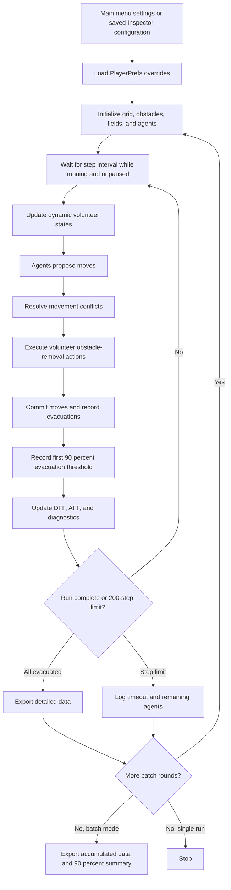

# LLM-EvacuationSim

A Unity crowd evacuation simulator combining a grid-based cellular automaton, floor-field navigation, movement conflict resolution, and dynamic volunteer decisions for obstacle removal. Volunteer decisions can use the implemented game-theoretic model or an LLM policy.

This README describes the current source and scene configuration. Research hypotheses and planned analysis tools are not presented as completed results.

## Requirements

- **Unity 6000.0.59f2 (Unity 6)**, as recorded in `ProjectSettings/ProjectVersion.txt`.
- Unity Hub and the build support module for your intended target, if building a player.
- Project packages are declared in `Packages/manifest.json` and resolved in `Packages/packages-lock.json`, including URP 17.0.4, Input System 1.14.2, and uGUI 2.0.0.
- Network access and an API key are needed only for actual remote LLM decisions. The game-theoretic mode runs without them. No Python service is required by the current implementation.

## Quick start

1. Add this repository folder to Unity Hub and open it with **6000.0.59f2**. Wait for package resolution and asset import.
2. Open `Assets/Scenes/MainMenu.unity` and enter Play mode.
3. Open **Settings** to configure the grid, agents, obstacles, strategies, and batch count. For an initial offline run, choose `OriginalGameTheory` and a batch count of `1`.
4. Apply settings and start the simulation. `MainMenuController.StartGame()` also saves settings before loading `SampleScene`.
5. Focus the Game view and press **Space** to toggle simulation stepping. To start a fresh simulation, reload the gameplay scene through the menu or restart Play mode.
6. Inspect the Console and generated CSV files in `Assets/data/`.

The build scene list contains `MainMenu` first and `SampleScene` second. Keep both enabled when building the application.

You can also open `Assets/Scenes/SampleScene.unity` directly. Its saved configuration uses **30 batch runs**, `Combined` movement, and `LLM` volunteer decisions. Existing `sim.*` PlayerPrefs override corresponding Inspector values even when entering this scene directly. The `SimulationManager` component context menu **Sync Current Values To MainMenu Settings** copies Inspector values into those saved settings.

## Implemented simulation

### Environment and update flow

`GridWorld.Init()` creates a rectangular grid with boundary walls and a centered, three-cell-wide exit on each of its four sides. Obstacles are generated at initialization, and agents spawn in a configurable area. The current menu does not provide the old README's named S1–S4 scenario presets.

The simulation uses discrete movement steps: evaluate volunteer decisions, propose agent moves, resolve competing requests for a cell, handle volunteer work, commit moves, and update floor fields and diagnostics. A run stops when all agents evacuate or the current **200-step limit** is reached. Reaching 90% evacuation is recorded as a metric; it does not end the run.

### Independent strategy settings

Movement, conflict resolution, and volunteer decisions are separate choices, rather than six interchangeable full-system policies.

| Setting | Implemented options |
| --- | --- |
| `movementStrategy` | `Static`, `Dynamic`, `Anticipation`, `Combined`, `AStar` |
| `conflictStrategy` | `Random`, `Closest`, `FirstCome`, `Probabilistic` |
| `volunteerDecisionMode` | `OriginalGameTheory`, `LLM` |

Floor-field navigation uses a static exit-distance field (SFF), a dynamic movement-trace field (DFF), and an anticipation field (AFF) associated with volunteers. `kStatic`, `kDynamic`, `kAnticipation`, and `movementTemperature` control their influence. A* is implemented in `Navigation/AStarPathfinding.cs`.

`YielderGame` selects a winner when agents request the same cell:

- `Random`: random contender.
- `Closest`: contender with the smallest grid Y coordinate.
- `FirstCome`: first contender in the supplied list.
- `Probabilistic`: selection weighted by `1 / (gridY + 1)`.

The latter two spatial rules are not general nearest-exit calculations for the four-exit map. The current implementation does not explicitly ask contenders to cooperate or defect.

### Volunteer decisions and obstacle removal

Agents transition between `None`, `PotentialVolunteer`, and `ActiveVolunteer`. Candidate evaluation uses obstacle visibility, local conditions, and the selected decision mode. Selected volunteers approach their assigned obstacle and remove it within the action range. Assignment prevents a volunteer from receiving multiple obstacles and an obstacle from receiving multiple active volunteers.

`OriginalGameTheoryVolunteerStrategy` samples volunteering with probability `1 - q`, where:

```text
x = max(2, nearbyAgentCount)
beta = clamp(volunteerCost / failureCost, 0.0001, 1)
q = clamp01((1 - exp(-omega * blockageRatio))^(1/x) * beta^(1/(x-1)))
```

The implementation also clamps blockage ratio and applies positive lower bounds to omega and failure cost. The exposed `volunteerCount` value is saved and reported, but current spawning initializes agents without volunteer assignments; active volunteer numbers are determined dynamically.

## Configuration

The main menu saves settings through `MainMenuSettingsController`; `SimulationManager` loads them at startup.

| Group | Main fields |
| --- | --- |
| Environment | Grid width/height, `agentCount`, spawn area width/height, `obstacleCount` |
| Execution | `batchRunCount`, `stepInterval` |
| Movement | `movementStrategy`, floor-field weights, `movementTemperature` |
| Conflicts | `conflictStrategy` |
| Volunteers | `volunteerDecisionMode`, `volunteerSelectionInterval`, `obstacleVisibilityRange`, `obstacleActionRange`, `volunteerCost`, `failureCost`, `unwillingnessOmega` |
| LLM | `openAIKey`, `openAIModel`, `maxLLMRequestsPerStep`, `debugLLMDecisionFlow` |
| Batch metrics | `ninetyPercentFallbackSteps` |

Values in the C# field initializers, serialized scenes, and saved PlayerPrefs can differ. For example, the source initializes `batchRunCount` to 1, while `SampleScene` serializes it as 30. Check the menu settings before comparing runs.

## LLM integration

The current `LLMDecisionPolicy` implementation sends requests directly from Unity using `UnityWebRequest` to the Chat Completions endpoint. The model field defaults to `gpt-4.1` in source and can be changed in settings.

To exercise the remote policy, select `LLM`, configure the model and API key, and enable `debugLLMDecisionFlow` to inspect requests and fallbacks in the Console. The API key is read from openai-key.local.txt in the project root (next to Assets) in the Unity Editor. Copy openai-key.example.txt to that filename and replace its contents with your key on a single line. This file is ignored by Git; never put keys in scenes or source code. The settings screen saves the key to the same file instead of PlayerPrefs. In a built player, the file lives in Application.persistentDataPath and must be provided separately. The file is plain text, not encrypted. If missing or empty, the existing mock fallback is used.

The implemented decision concerns **volunteering for obstacle removal**. Context includes agent position, nearby agents and obstacles, exit distance, current volunteers, target-obstacle location, and an estimated evacuation impact. The expected response is:

```json
{
  "decision": "volunteer",
  "explanation": "Removing the target obstacle may improve evacuation flow."
}
```

`decision` is either `volunteer` or `selfish`. Movement and conflict resolution continue to use their separately configured strategies.

The manager uses `MockLLMVolunteerStrategy` when the key is absent, the per-step request cap is reached, or a request fails. This is a local heuristic, not an LLM response. Consequently, selecting `LLM` does not mean every decision came from a remote model. Console messages report API and mock fallback counts. The request implementation has a 25-second timeout and up to two retries.

## Output and metrics

`SimulationData` writes to `Path.Combine(Application.dataPath, "data")`. In the Editor this is **`Assets/data/`**; in a built player it follows that player's `Application.dataPath` and requires a writable location.

Detailed filenames use `yyyy-MM-dd_HHmmss_runNNN_Strategy_suffix.csv`. Here, `Strategy` is the **conflict strategy**, not a complete description of movement and volunteer settings.

| File suffix | Contents |
| --- | --- |
| `_params.csv` | Floor-field weights, temperature, initial agent and obstacle counts |
| `_agents.csv` | Agent ID, evacuation step, evacuation time |
| `_global.csv` | Total steps/time, exported time statistics, evacuated count |
| `_diagnostics.csv` | Per-step remaining agents, conflicts, volunteer actions, remaining obstacles, average DFF/AFF |
| `_llm_decisions.csv` | Recorded decision and explanation entries, when present |
| `_batch_summary.csv` | Batch configuration and aggregate steps/time to 90% evacuation, including success/failure counts |

### Interpretation and current limitations

- A successful single run exports automatically. The single-run 200-step timeout branch logs remaining agents but does not call `ExportData()`.
- `ExportData()` skips detailed output if there are no evacuation records. Diagnostics and decision files are also omitted when their respective record lists are empty.
- Batch mode repeats the current configuration. It does not automatically sweep strategies, scenarios, or explicit random seeds.
- Batch summary statistics measure **90% evacuation**, not full evacuation. Runs that never reach 90% contribute `ninetyPercentFallbackSteps` (source default: 150) and `ninetyPercentFallbackSteps * stepInterval` as substitute values. Read `SuccessRuns90Pct` and `FailedRuns` alongside averages.
- Batch mode reuses one `SimulationData` instance across rounds. Detailed records accumulate under the default `run001` label, and step counters restart each round. These exports are not independent, uniquely labeled per-run datasets; global statistics should not be treated as clean per-round aggregates.
- `_global.csv` currently computes `AvgTimePerAgent` as total elapsed time divided by evacuated record count. `StdTime` uses that value as its center. For conventional mean and standard deviation of individual evacuation times, recompute them from `_agents.csv`, accounting for the batch labeling limitation.
- `elapsedTime` advances in `Update()` only while stepping is allowed. Pauses and in-progress step coroutines, including LLM waits, are excluded; it is not end-to-end wall-clock runtime.
- The parameter snapshot is partial. Preserve the complete configuration separately when comparing experiments.

## Visualization

The project includes agent/grid visualization and UI scripts for step count, evacuation progress, volunteers, remaining obstacles, and batch round display.

`HeatmapRenderer` draws **dynamic floor-field values through `OnDrawGizmos()`**. It requires assigned world/manager references and Gizmos enabled; it is not a standalone runtime crowd-density or trajectory heatmap. `StatisticsPanel` provides an additional statistics display component.

## Source layout

```text
Assets/
  Scenes/
    MainMenu.unity
    SampleScene.unity
  scripts/
    Core/           CellType, GridWorld, SimulationManager
    Agent/          PedestrianAgent, AgentManager
    Navigation/     FloorField, StaticFloorField, DynamicFloorField,
                    AnticipationFloorField, AStarPathfinding
    Decision/       YielderGame, VolunteerDilemma, LLMDecisionPolicy,
                    IVolunteerDecisionStrategy, VolunteerDecisionContext,
                    OriginalGameTheoryVolunteerStrategy, MockLLMVolunteerStrategy
    Data/           SimulationData
    UI/             MainMenuController, MainMenuSettingsController,
                    SimulationUIController, InGameUIController
    Visualization/  HeatmapRenderer, StatisticsPanel
  data/             Generated CSV output
Packages/           Unity package manifests
ProjectSettings/    Editor version, build scenes, and project settings
```

## Research scope

The project explores how volunteer decision policies affect cooperation and evacuation performance. The previous README also described proposed random-walk/greedy policy classes, an `ExperimentRunner`/`ExperimentAnalyzer` framework, trajectory playback, comparison charts, an LLM explanation panel, statistical significance tests, and a proposed 720-run dataset. These are not implemented or established by the current simulation scripts and should be treated as possible future work, not available features or validated findings.

# Simulation Workflow

Original conceptual workflow, preserved from the project plan. The diagram below shows the current implementation order; trajectory and exit-flow outputs listed here remain planned.

Initialize Simulation

- Create environment grid
- Spawn pedestrian agents
- Initialize floor fields

Simulation Step

- Identify potential volunteers
- Select volunteers
- Update anticipation field
- Agents propose moves
- Resolve movement conflicts
- Commit movements
- Update dynamic floor field

Simulation outputs include:

- agent trajectories
- evacuation time
- volunteer statistics
- exit flow rate

---

## Current simulation flow



Detailed export conditions and batch aggregation caveats are documented under **Output and metrics**.

# Experimental Design (Original Research Plan)

The following design is retained as a research target. Its strategy suite, scenario presets, seeded repetitions, and complete data collection are not all automated or implemented in the current project.

## Independent Variables

We vary the following factors:

### Strategy
- Random Walk
- Greedy Navigation
- A* Pathfinding
- Probabilistic Game Theory
- Context-Aware Game Theory
- LLM-Based Policy

### Crowd Density
- Small (25 agents)
- Medium (50 agents)
- Large (100 agents)

### Scenario Types
- S1: Single exit (no obstacle)
- S2: Single exit (blocked)
- S3: Dual exits (one blocked)
- S4: High-density congestion scenario

---

## Controlled Variables

To ensure fair comparison across strategies, the following are fixed:

- Grid size
- Agent movement speed
- Observation range
- Simulation time step
- LLM input format (prompt structure)

---

## Experimental Procedure

1. Run each configuration **30 times** with different random seeds
2. Record all evaluation metrics for each run
3. Compute mean and standard deviation
4. Perform cross-strategy comparison

---

## Data Collection

For each simulation run, the system records:

- Evacuation time
- Agent trajectories
- Conflict events
- Volunteer decisions
- Exit usage statistics

All results are exported in CSV format for analysis.

---

# Development Schedule

Original development timeline (9 weeks). This schedule is preserved as the project plan; entries such as "Complete" describe planned milestones, not verified completion status. See the implemented features and limitations above for current behavior.

## Phase 1: Core Framework (Week 1-6)

### Week 1
Project initialization, grid environment, and basic agent system
- Complete: GridWorld, PedestrianAgent, SimulationManager
- Begin: AgentManager

### Week 2
Agent system and Static Floor Field navigation
- Complete: AgentManager, StaticFloorField
- Begin: First baseline strategy (Greedy)

### Week 3
Parallel movement updates and conflict resolution
- Complete: Movement synchronization, YielderGame
- Begin: Probabilistic decision model

### Week 4
Obstacle system and advanced navigation
- Complete: Obstacle mechanics, A* Pathfinding
- Begin: ExperimentConfig and ExperimentRunner

### Week 5
Volunteer dilemma and obstacle removal mechanics
- Complete: VolunteerDilemma, obstacle removal logic
- Enhance: Data collection infrastructure

### Week 6
Dynamic Floor Field, Anticipation Field, and visualization
- Complete: DynamicFloorField, AnticipationFloorField
- Implement: Basic visualization (heatmaps, statistics panel)
- Prepare: ExperimentConfig and initial testing scenarios

## Phase 2: Advanced Systems (Week 7-9)

### Week 7
LLM decision policy integration and explainability
- Integrate: LLMDecisionPolicy with decision explanation
- Complete: LLMDecisionExplainer visualization
- Run: Initial experiments to validate system behavior
- Debug: LLM decision consistency and performance

### Week 8
Comprehensive simulation experiments and statistical analysis
- Run: Full parameter sweep with all 6 strategies
- Collect: All metrics across 30 runs per scenario
- Complete: ExperimentAnalyzer, comparison charts
- Analyze: Mean, standard deviation, and performance comparison

### Week 9
Data analysis, visualization, and final presentation
- Generate: Performance reports and statistical comparisons
- Create: Publication-quality charts and visualizations
- Prepare: Final presentation and research paper
- Interpret: Differences between LLM and baseline strategies

---

# References

1. Lin, G. W., & Wong, S. K. (2018).
Evacuation simulation with consideration of obstacle removal and using game theory. Physical Review E.

2. Helbing, D., Farkas, I., & Vicsek, T. (2000).
Simulating dynamical features of escape panic.

3. Nishinari, K., Kirchner, A., Namazi, A., & Schadschneider, A. (2004).
Cellular automaton approach to pedestrian dynamics.
